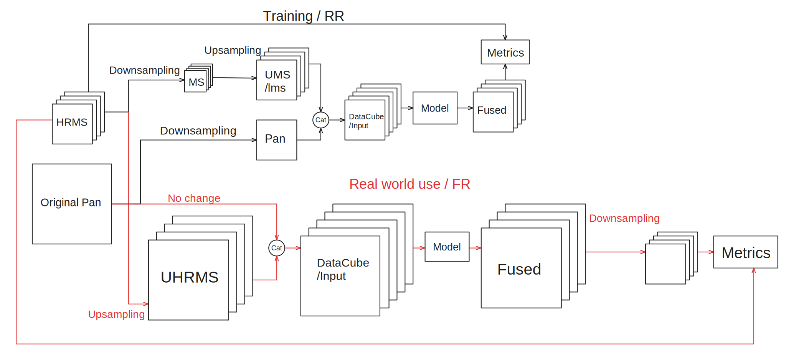

- [1 - Data](#1---data)
  - [1.1 - Preprocessing](#11---preprocessing)
    - [1.1.1 - Data choices](#111---data-choices)
      - [1.1.1.1 - PanCollection](#1111---pancollection)
      - [1.1.1.2 - Other](#1112---other)
    - [1.1.2 - Data preparation](#112---data-preparation)
      - [1.1.2.1 Original data](#1121-original-data)
      - [1.1.2.2 Downsampling the data](#1122-downsampling-the-data)
      - [1.1.2.3 Making the input block](#1123-making-the-input-block)
    - [1.1.3 - Data feeding](#113---data-feeding)
    - [1.1.4 - Overall data flow](#114---overall-data-flow)
- [2 - Metrics :](#2---metrics-)
  - [1 - ERGAS :](#1---ergas-)
  - [2 - SAM :](#2---sam-)
- [3 - Model](#3---model)

# 1 - Data
## 1.1 - Preprocessing
### 1.1.1 - Data choices
#### 1.1.1.1 - PanCollection
We will be using the [PanCollection](https://github.com/liangjiandeng/PanCollection) data to train and test the models for uniformity and comparability bewteen the models (Trained under the same data and tested under the same data).

PanCollection provides already prepared **training**, **validation** and **test** data for these following satelites:
  - WorldView-2 
  - WorldView-3
  - Gaofen-2
  - QuickBird

There are two types of **test** data provided:
  - **Full Resolution** (FR) :
  Which is the original PAN and HRMS images (this is the **real way the model should be used**) no refrerence (GT) is available for this data.
  
  - **Reduced Resolution** (RR) :
  Which is the PAN and MS images (this is **the way the model is trained**) and the HRMS image (this is the GT) is available for this data. (the way this data is generated is explained in the next section).

#### 1.1.1.2 - Other 
Since we have already prepared data that has been used to train the list of models in the [DLPan](https://github.com/liangjiandeng/DLPan-Toolbox) we just need to understand and explain how the data was prepared. 
If needed, we can also prepare the provided data in the same way as the DLPan.

### 1.1.2 - Data preparation
#### 1.1.2.1 Original data
Initially the data is given in pairs of **Panchromatic** and **Multispectral** images these two images provided by the satelites will be referred to as **Original PAN** and **HRMS** respectively, reffering to the native resolution of the images. 

#### 1.1.2.2 Downsampling the data
In order to train a model we need to provide an **input** (x) and a **refrence** (y) for it to train.

- As **refrence** we can use only the **HRMS**, as the models outputs only the multispectral data.

- As for the **input** we need to generate a degraded version of the **HRMS** that we will refer to as **MS**. Also a downsampled version of the **Original PAN** image that we refer to as **PAN**.

The downsampling method for the HRMS and Original PAN can be done diffrently:
- for the Original PAN, an ideal filter (bicubic interpolation) can be used this results in the PAN image (in our case being downsampled by a factor of 4).

- for the HRMS we apply an MTF (Modulation Transfer Function) to it, provided that the Nyquist frequency for each channel in data from a certain sensor is known we can generate a filter that will be applied to the HRMS image to **simulate the degradation that would be caused by the sensor** this mainly why this method is applied. This results in the **(MS)** image. 
```Python
    GNyq_dict_ms = {
        'QB':       [0.34,  0.32,  0.30,  0.22], # Band Order: B,G,R,NIR
        'IKONOS':   [0.26,  0.28,  0.29,  0.28],    # Band Order: B,G,R,NIR
        'GeoEye1':  [0.23,  0.23,  0.23,  0.23],    # Band Order: B,G,R,NIR
        'WV2':      [0.35,  0.35,  0.35,  0.35,  0.35,  0.35,  0.35,  0.27],
        'WV3':      [0.325, 0.355, 0.360, 0.350, 0.365, 0.360, 0.335, 0.315]
    } 
```
We can also use the MTF downsample method on the Original PAN image following these values to genrate the PAN image (Inplemented in V2 of the DLPan MTF generator):
```Python
    GNyq_dict_pan = {
        'QB':       0.15,
        'IKONOS':   0.17,
        'GeoEye1':  0.16,
        'WV2':      0.11,
        'WV3':      0.5
    }
```
[fast PyTorch implementation from Z-PNN](https://github.com/matciotola/Z-PNN/blob/master/input_prepocessing.py#L134)

Then for each channel a kernel (filter) is generated we apply a depthwise convolution to the HRMS image using the kernel for each channel to result in the MS image. In depthwise conv the kernel is applied to each channel seperatly, this is done to simulate the MTF of the sensor on each channel.
We follow this by a bicubic interpolation to the desired resolution.
```Python
# DepthWise-Conv2d definition
depthconv = nn.Conv2d(in_channels=channels,
                      out_channels=channels,
                      kernel_size=MTF_kern.shape,
                      groups=channels,          # This the parameter to seperate the channels in the convolution
                      padding=20,               # The original implementaion proposes fixed values    
                      padding_mode='replicate', # I propose using padding "same" to keep the image size the same
                      bias=False)
depthconv.weight.data = MTF_kern
depthconv.weight.requires_grad = False
```


This differs from a normal conv in which the kernel is applied to all channels at once.


#### 1.1.2.3 Making the input block
The input block is made by concatenating the PAN and MS images along the channel axis, this results in a MS+1 channels image that is used as input for the model but since the MS ans PAN images are of diffrent sizes we need to upsample the MS image to the same size as the PAN image.

The upsampling of the MS image can be done by using the 23-tap interpolation method to to result an **UMS** image of the same size as the PAN image in height and width.

### 1.1.3 - Data feeding
After normalizing by the highest values in the images (provided by user).
```Python
lms = self.lms[index]
lms /= self.img_scale

pan = self.pan[index]
pan =  pan if not self.highpass else pan - cv2.boxFilter(pan, -1, (5, 5))
pan /= self.img_scale

ms = self.ms[index]
ms = ms if not self.highpass else ms - cv2.boxFilter(ms, -1, (5, 5))
ms /= self.img_scale

gt = self.gt[index]
gt /= self.img_scale
```
The data is fed to the model in the form of a dictionary using a dataloader each return of the dataloader is a dictionary containing the PAN, MS, LMS and optionally GT images.
Where :


- For Reduced Resolution data:
    - ms : The downsampled HRMS image **(MS)**
    - lms : The upsampled MS image **(UMS)**
    - pan : The downsampled Original PAN image **(PAN)**
    - gt : The HRMS image **(HRMS)**
```Python
return {
    'ms':ms.astype(np.float32),
    'lms':lms.astype(np.float32),
    'pan':pan.astype(np.float32),
    'gt':gt.astype(np.float32)
}
```
- For Full Resolution data:
    - ms : The HRMS image **(HRMS)**
    - lms : The uspsampled HRMS image **(UHRMS)**
    - pan : The Original PAN image **(Original PAN)**
```Python
return {
    'ms':ms.astype(np.float32),
    'lms':lms.astype(np.float32),
    'pan':pan.astype(np.float32),
    }
```

Notice that in full resolution data we don't have a GT image, this is becuase the HRMS image that is used in input is the highest resolution available so there is nothing to compare to.

Also notice that because pytorch default precision is float32 we need to convert the images to float32 before feeding them to the model as numpy's default precision is float 64.

For each dictonary every entry contains a tensor of shape (B x C x H x W) where:
- B : Batch size defined in dataloader
- C : Number of channels in the image
- H : Height of the image
- W : Width of the image

Note : for the pannet model we need a highpass version of the PAN image, this is done by subtracting the image from a box filter of the same image with a kernel size of (5,5) this is done to remove the low frequency components of the image, this why the highpass flag is used in the dataloader here: 
```Python
...
pan =  pan if not self.highpass else pan - cv2.boxFilter(pan, -1, (5, 5))
...
ms = ms if not self.highpass else ms - cv2.boxFilter(ms, -1, (5, 5))
...
```

### 1.1.4 - Overall data flow


# 2 - Metrics :

For reproducibility we use metric fucntions provided by torchmetrics (a library that provides metrics for pytorch) to evaluate the models. it provides most of the metrics but not all of them, so we need to implement the missing metrics.

All the metrics that are used :
## 1 - ERGAS :
The ERGAS (Error Relative Global Adimensional Synthesis) is a metric that is used to evaluate the quality of the image, it is defined as the ratio of the Root Mean Square Error (RMSE) to the mean value of the image. It is used to evaluate the quality of the image in terms of the **spectral information**.


its formula is as follows:

$$
\mathop{\text{ERGAS}}=100 \frac{d_h}{d_l} \sqrt{\frac{1}{N} \sum_{n=1}^N\left(\frac{\mathop{\text{RMSE}}(n)}{\mu(n)}\right)^2}
$$

where:
  - $\frac{d_h}{d_l}$ : The ratio of high over resolution
  - $N$ : The number of bands in the image
  - $\mathop{\text{RMSE}}(n)$ : The RMSE of the $n^{th}$ band
  - $\mu(n)$ : The mean value of the $n^{th}$ band

The code for the ERGAS metric is as follows:
```Python
100 * ratio * torch.sqrt(torch.mean(torch.mean((ms_gt-ms_fus)**2,axis=(2,3))/(torch.mean(ms_gt, axis=(2,3)))**2))
```
**PS : in the DLpan implementation the ratio is flipped which gives a lower value**

## 2 - SAM :
The Spectral Angle Mapper (SAM) is a metric that is used to evaluate the quality of the image, it is defined as the angle between the two vectors that represent the two images in the spectral space. It is used to evaluate the quality of the image in terms of the **spectral information**.

its formula is as follows:

$$
\mathop{\text{SAM}}(\mathbf{x}, \hat{\mathbf{x}})=\arccos \left(\frac{\langle\mathbf{x}, \hat{\mathbf{x}}\rangle}{\|\mathbf{x}\|_2 \cdot\|\hat{\mathbf{x}}\|_2}\right)
$$
The code for the SAM metric is as follows:
```Python
    prod_scal = torch.sum(ms_gt * ms_fus, axis=1)
    # Slightly different from the original equation, square root of the product of the sums not the product of the nomrs
    norm_gt = torch.sum(ms_gt**2, axis=1)
    norm_fus = torch.sum(ms_fus**2, axis=1)
    lower_term = torch.sqrt(norm_gt * norm_fus)
    lower_term = torch.where(lower_term == 0, epsilon, lower_term) # to avoid division by zero
    SAM_map = torch.arccos(prod_scal/lower_term)
    angolo = torch.mean(SAM_map, axis=(1,2))
    SAM_index = torch.rad2deg(angolo)   
    return SAM_index
```
**PS : The angle is in radians so in the DLpan implementation it is converted to degrees.**
# 3 - Model
